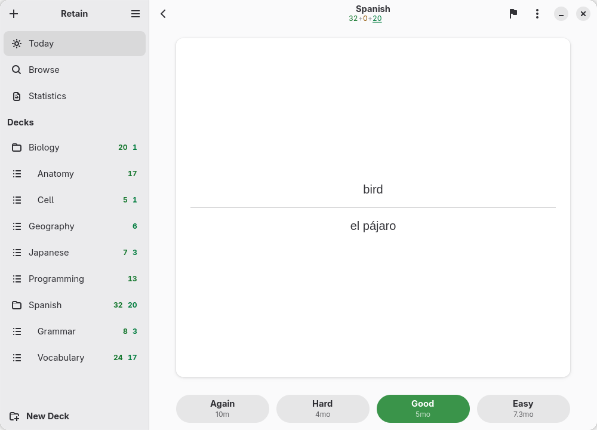
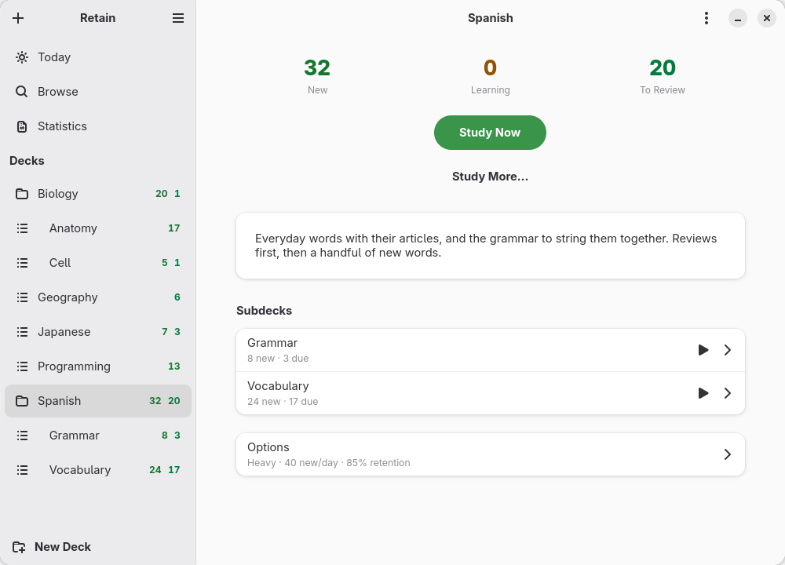
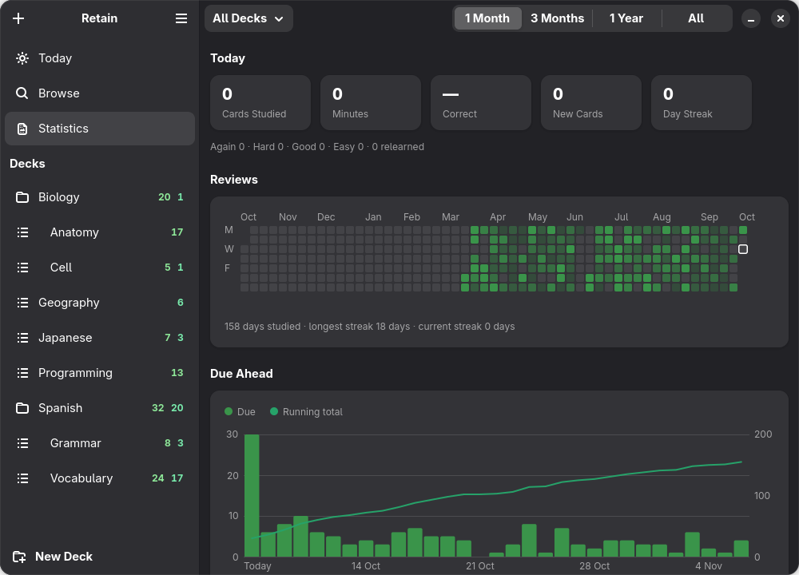

<div align="center">


# Retain

**Flashcards that come back just before you forget.**

A native GNOME flashcard app with spaced repetition. It opens Anki decks and writes them
back, schedules with FSRS, and keeps the clutter out.



</div>

## What it does

- **Decks** nested as deep as you like, with new, learning and due counts in the sidebar.
- **Cards** of every kind: basic, reversed, type in the answer, cloze deletions, and image
  occlusion (hide parts of a picture), all built in.
- **Three study modes:** flip, type the answer (graded leniently), or choose it from options
  drawn from the deck.
- **Reviews with the keyboard:** Space turns the card, 1 to 4 grade it, and the buttons say
  how long each grade waits. Hard is not a fail. Ctrl+Z undoes a grade and shows the card
  again.
- **FSRS scheduling,** the algorithm Anki uses, with a desired-retention slider instead of a
  page of settings, and an Optimize button that fits the model to your own history.
- **Anki decks in and out:** `.apkg` and `.colpkg` with pictures, sounds, note types,
  scheduling and review history; shared decks render as Anki renders them.
- **Search** across every card with Anki's syntax, bulk actions with undo.
- **Cards read aloud** in your system's voices, each language in its own (Anki's `{{tts}}`
  works too), with the furigana's reading for Japanese.
- **Card-mining apps** such as Yomitan add cards straight into Retain through the AnkiConnect
  API they already speak (off until you turn it on; only programs on your computer).
- **Statistics:** a heatmap of the year, what is due ahead, retention, card counts,
  intervals, and when in the day you study.
- **Undo everything,** from a grade to a deleted deck.

It fits right in: light and dark styles, your accent colour, and windows down to phone size.

<table>
  <tr>
    <td></td>
    <td></td>
  </tr>
</table>

The screenshots show an invented demo collection (`scripts/demo_collection.py`).

## Getting it

It isn't on Flathub yet. To build and install it yourself you need Python 3.12, PyGObject
3.50, GTK 4.20, libadwaita 1.9, WebKitGTK 6.0 (for the card face), GStreamer (for sounds),
Meson 1.2 and `blueprint-compiler` 0.22 (Meson downloads its own when the installed one is
missing or older). Fedora 44, Ubuntu 26.04, Arch Linux and openSUSE Tumbleweed ship them.

```sh
git clone https://github.com/Jackicus/GNOME-Retain.git
cd GNOME-Retain
meson setup build --prefix=/usr
meson install -C build
```

On Arch, `build-aux/aur/PKGBUILD` builds a package. For a look without installing,
`scripts/run.sh --demo` runs a development build on the invented collection.

Your collection lives in `~/.local/share/retain/`, with backups beside it. There is no cloud
sync: the [user guide](docs/user-guide.md) says how to move it.

## Reviewing

| To | Key |
|---|---|
| Show the answer, or Good | <kbd>Space</kbd> or <kbd>Enter</kbd> |
| Again, Hard, Good, Easy | <kbd>1</kbd> <kbd>2</kbd> <kbd>3</kbd> <kbd>4</kbd> |
| Edit, Suspend, Bury, Mark, Flag | <kbd>E</kbd> <kbd>S</kbd> <kbd>B</kbd> <kbd>M</kbd> <kbd>F</kbd> |
| Card information | <kbd>I</kbd> |
| Replay sound, read aloud | <kbd>R</kbd> <kbd>V</kbd> |
| Undo | <kbd>Ctrl</kbd> <kbd>Z</kbd> |

<kbd>Ctrl</kbd> <kbd>?</kbd> shows every shortcut.

## How it works

**Your collection is one SQLite file** (`collection.sqlite`), holding decks, note types,
notes, cards and every review you have made. Pictures and sounds sit in a `media/` folder
beside it, and a backup is taken at most every six hours (the last ten are kept). Nothing
leaves your computer.

**Notes make cards.** A note holds fields (Front, Back; or Expression, Meaning, Reading), and
its note type's templates turn those fields into one or more cards: `{{Front}}`
replacements, conditionals, cloze deletions, hints, type-in answers and furigana, rendered
the way Anki renders them. A WebKit view draws the card face, so shared decks with their own
HTML and CSS look as their authors meant; everything around it is GTK and libadwaita.

**FSRS decides when a card comes back.** Every card has a stability (how many days until
your chance of recalling it falls to 90%) and a difficulty. Each grade updates both, and
the next review is set for the day your chance of remembering drops to your desired
retention (90% by default; one slider per deck). The Optimize button fits FSRS's parameters
to your own review history.

**Every change can be undone.** Edits, grades, deletions and moves are recorded as undo
steps, so a mistake costs Ctrl+Z rather than a confirmation dialog.

**Anki's formats both ways.** `.apkg` and `.colpkg` packages, old and new (zstd), are
read with their note types, media, scheduling and history, and written back in a form Anki
and AnkiDroid open. CSV and TSV files import with Anki's header lines.

In the code, the model (`collection.py`, `scheduler.py`, `fsrs.py`, `template.py`,
`search.py`, `apkg.py`) has no GTK in it and is tested without a display; the window, pages
and dialogs in `src/` sit on top. `CLAUDE.md` has the full map.

## Contributing

`scripts/check.sh` runs the lint, the build and the tests; `CLAUDE.md` describes the code and
its rules, `docs/decisions.md` the choices and why. Translations go in `po/`. Bugs and ideas
go in the [issue tracker](https://github.com/Jackicus/GNOME-Retain/issues).

## Licence

GPL-2.0-or-later. Anki is a trademark of its owners; Retain is not affiliated with it. The
FSRS formulas follow the open-spaced-repetition project's MIT-licensed reference
implementations.
